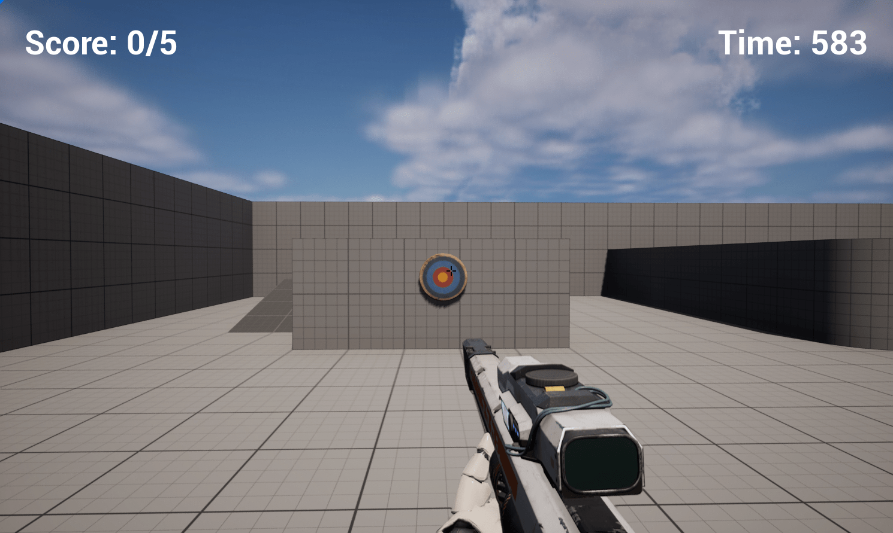

# Speed Fire

3D FPS mini-game made with Unreal. The goal is to shoot all the targets before the timer runs out.  

Blueprint project made following [a UE5 tutorial by Unreal Sensei](https://www.youtube.com/watch?v=1XjgLKrb4_M).  

[Download the executable here.](https://mofumofustudios.itch.io/speed-fire)  

